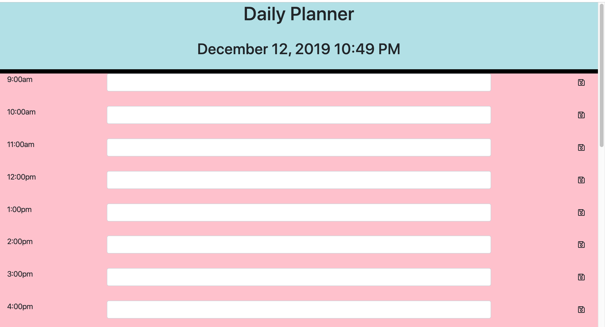

# Homework-5
A functioning day planner to record daily tasks using moment.js

In this project, I have successfully created a daily log for activities and to-dos. 
there is a timer using moment.js that displays the date and time at the top of the 
screen that automatically updates to local date and time.  There is also fontawesome 
icons that allow the user to click and save theiritems to local storage.  

